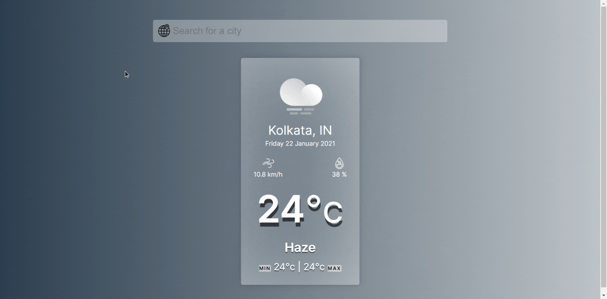

# Weather-Web-App

A Web Application created using Vanilla JS to check Current Weather Data of any place on Earth.

# Uses
<ul>
  <li> Geolocation API - for fetching current location on load</li>
  <li> OpenWeatherMap API - for fetching weather data on searching </li>
</ul>
